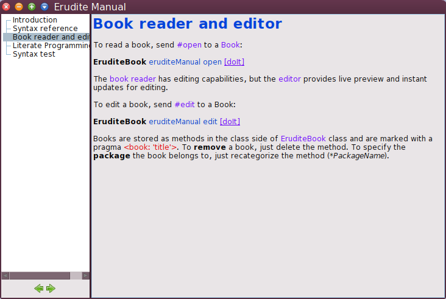

# Erudite

Documentation system for Cuis Smalltalk.

## Overview

Erudite provides the following to document Smalltalk programs:

* **Markup for linking and evaluating Smalltalk code.** Links to Smalltalk classes, methods, selectors, senders, implementators, etc.
* **Books.** Books are basically a collection of Documents organized in sections.
* **Book reader and editor.** Morphic applications for Book reading and editing.

## Install

To install the core (markup and Erudite reader and editor):

```Smalltalk
Feature require: 'Erudite'
```

Extensions to Smalltalk tools (browser, workspace, etc) are provided in a separate package:

```Smalltalk
Feature require: 'EruditeToolsExtensions'
```

There's also a PetitParser tutorial book included. Install it doing:

```Smalltalk
Feature require: 'PetitParserTutorial'
```

# Screenshots


